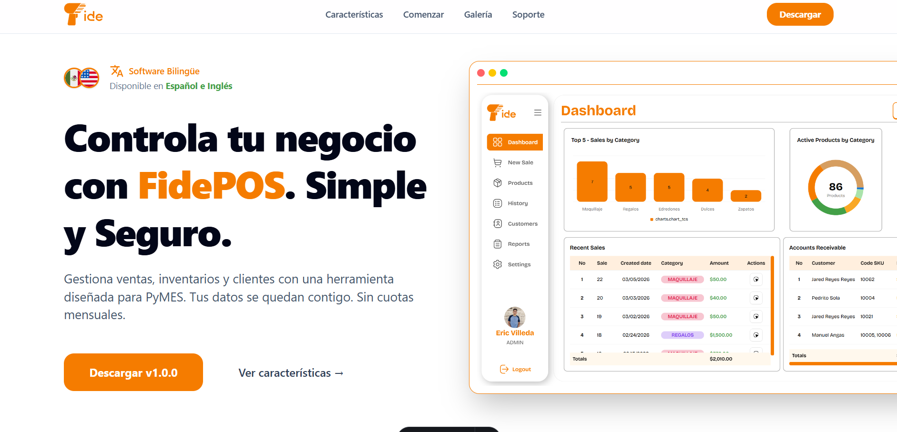
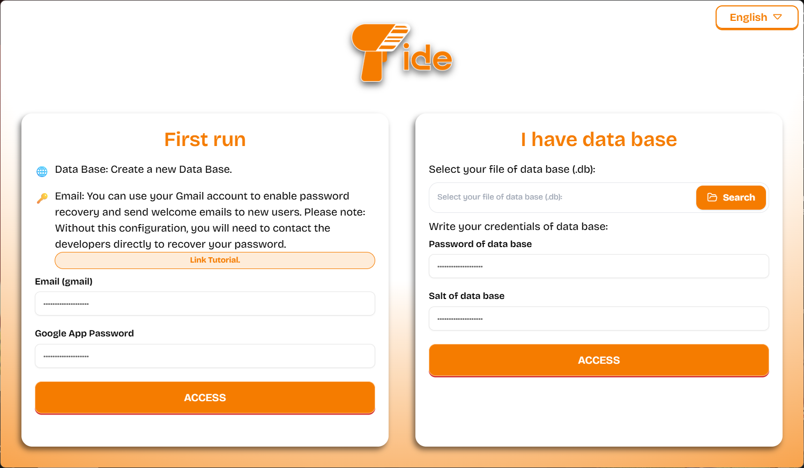
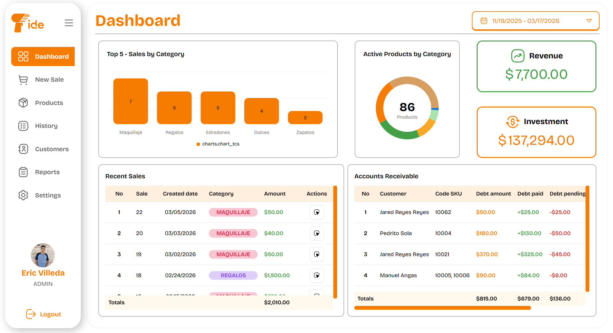
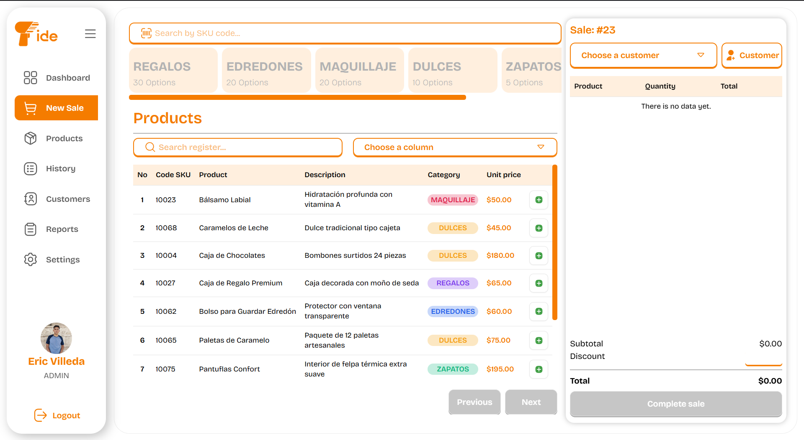
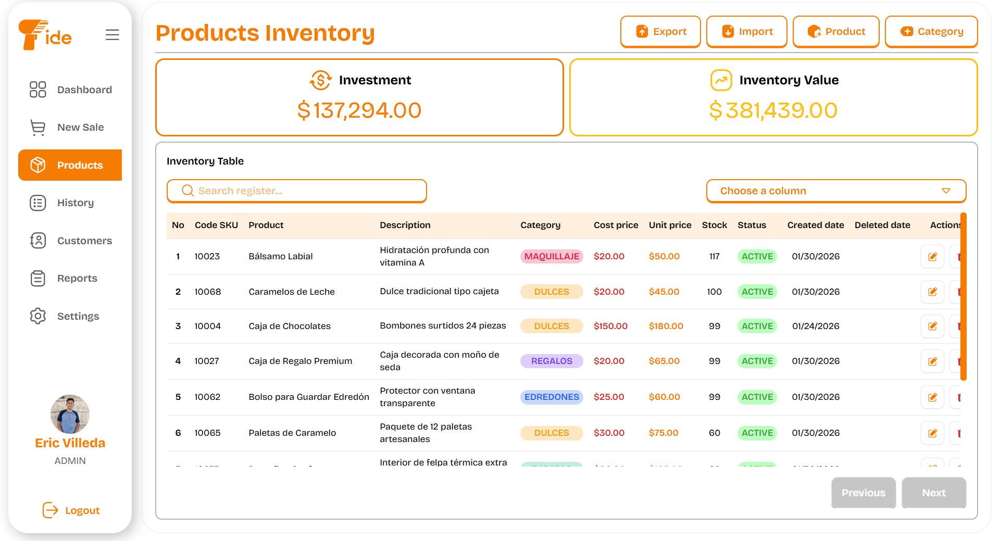
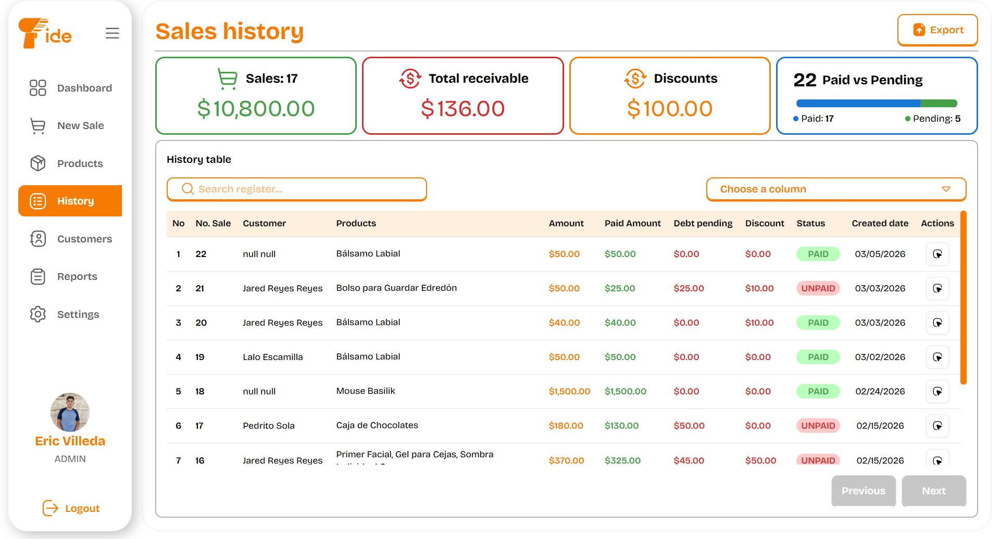
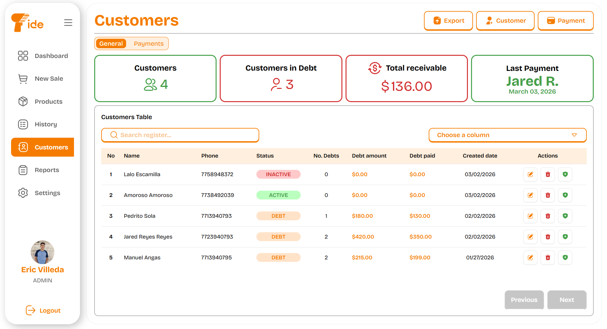
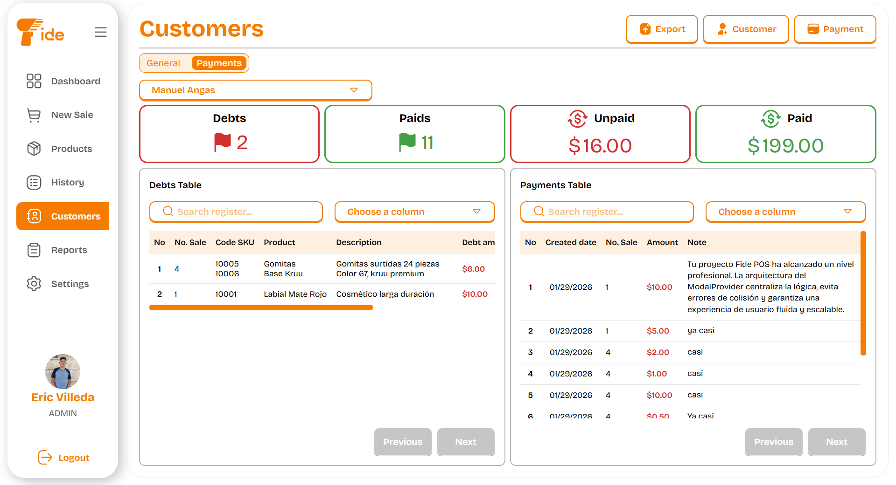
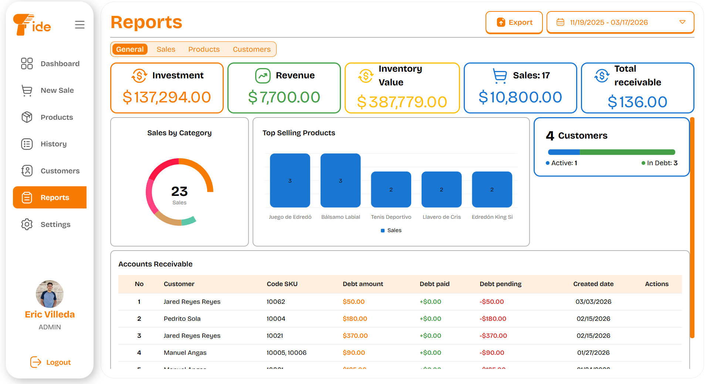
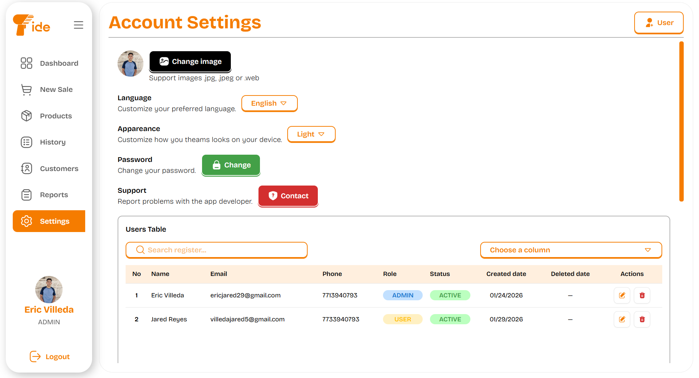

<div align="center">
    

# FidePOS - Sitio Web

Web de aplicación de escritorio de punto de venta para PyMEs. Permite gestionar ventas, inventario, ingresos y pérdidas con reportes claros y en tiempo real, ayudando a mejorar la eficiencia y el control financiero del negocio.

  
</div>

#

<p align="center" >
  <a href="https://skillicons.dev">
    
  </a>
  <br />
  
  
  
</p>

## 📋 Tabla de contenidos

- [FidePOS - Sitio Web](#fidepos---sitio-web)
- [](#)
  - [📋 Tabla de contenidos](#-tabla-de-contenidos)
  - [📖 Descripción](#-descripción)
  - [🎥 Demo](#-demo)
  - [🛠️ Tecnologías](#️-tecnologías)
  - [✅ Requisitos previos](#-requisitos-previos)
  - [🚀 Instalación](#-instalación)
  - [💻 Uso y Scripts](#-uso-y-scripts)
  - [📸 Sistema](#-sistema)
  - [📁 Estructura del proyecto](#-estructura-del-proyecto)
  - [📄 Licencia](#-licencia)

---

## 📖 Descripción

**FidePOS** Página web de aplicación de escritorio de punto de venta para PyMEs. Permite gestionar ventas, inventario, ingresos y pérdidas con reportes claros y en tiempo real, ayudando a mejorar la eficiencia y el control financiero del negocio.

- 📦 **Gestión de Inventario:** Control total sobre productos, categorías y stock.
- 👥 **Administración de Clientes:** Seguimiento de deudas, historial de pagos y perfiles.
- 📊 **Dashboard Interactivo:** Visualización de métricas clave y estadísticas de venta mediante gráficas.
- 📄 **Reportes Profesionales:** Generación y exportación de datos en formatos **PDF, Excel y CSV**.
- 🖥️ **Arquitectura de Escritorio:** Ejecución local segura y rápida (vía Electron).
- 🌐 **Soporte Multi-idioma:** Inglés y Español con i18n.

---

## 🎥 Demo

> [🌐 Ver demo en vivo](https://fidepos.netlify.app) · [Reportar bug](https://github.com/EricV29/fidepos-web/issues)

---

## 🛠️ Tecnologías

| Capa            | Tecnología                       |
| --------------- | -------------------------------- |
| Frontend        | Astro 6                          |
| Estilos         | Tailwind CSS 4                   |
| Package manager | pnpm                             |

---

## ✅ Requisitos previos

- Node.js
- npm

---

## 🚀 Instalación

```bash
# 1. Clonar el repositorio
git clone https://github.com/EricV29/fidePOS-web.git
cd fidePOS-web

# 2. Instalar dependencias
npm install
```

---

## 💻 Uso y Scripts

```bash
# Ejecutar modo desarrollo (Vite y Electron):
pnpm run dev

# Generar Build de producción:
pnpm run build

# Genera un paquete de producción utilizando electron-builder:
pnpm run preview

```

Accede a la app en `http://localhost:5173`.

---

## 📸 Sistema

| Vista del Sistema                           | Descripción                                                                                                                                                                                         |
| :------------------------------------------ | :-------------------------------------------------------------------------------------------------------------------------------------------------------------------------------------------------- |
|       | **Bienvenida:** Dos opciones de arranque: 1. Base de Datos nueva con o sin credenciales para correos electrónicos. 2. Si ya tienes una Base de Datos de FidePOS agregala y coloca tus credenciales. |
|     | **Panel Principal:** Visualización de métricas de ventas diarias, ganancias y estado general del negocio mediante gráficas interactivas.                                                            |
|    | **Ventas:** Interfaz ágil para registrar nuevas ventas, aplicar descuentos y procesar diferentes métodos de pago.                                                                                   |
|    | **Inventario:** Control total de stock, categorías y precios.                                                                                                                                       |
|        | **Historial de Ventas:** Registro cronológico detallado de todas las transacciones realizadas.                                                                                                      |
|  | **Clientes:** Directorio centralizado para gestionar la información de contacto y perfiles de compradores frecuentes.                                                                               |
|    | **Deudas y Pagos de Clientes:** Seguimiento especializado de créditos, saldos pendientes y registro histórico de abonos de clientes.                                                                |
|         | **Reportes:** Interfaz Herramienta para exportar métricas de rendimiento y cierres de caja en formatos profesionales como PDF y Excel.                                                              |
|    | **Configuración:** Personalización del sistema, gestión de usuarios y gestion de categorías.                                                                                                        |

---

## 📄 Licencia

Distribuido bajo MIT. Consulta [`LICENSE`](LICENSE) para más información.
